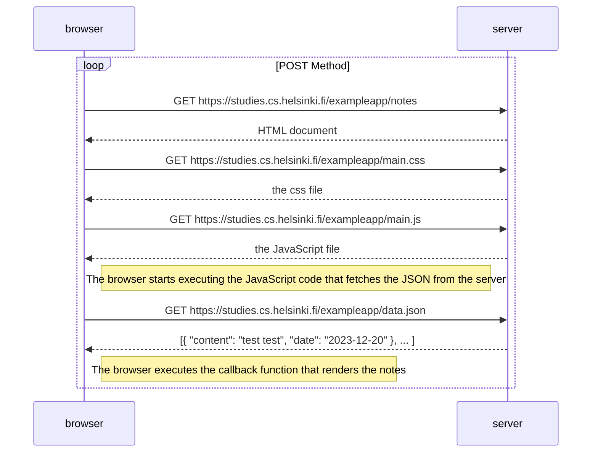
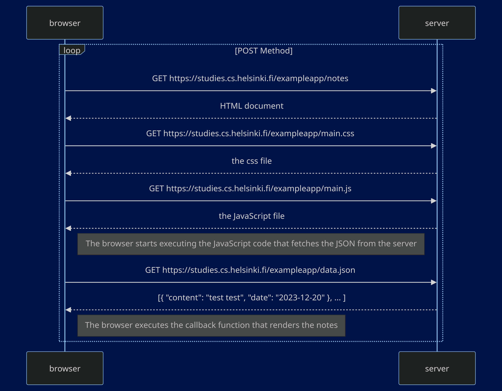

# 0.4: new note

```mermaid
sequenceDiagram
participant browser
participant server

    loop POST Method
        browser->>server: GET https://studies.cs.helsinki.fi/exampleapp/notes
        server-->>browser: HTML document


        browser->>server: GET https://studies.cs.helsinki.fi/exampleapp/main.css
        server-->>browser: the css file


        browser->>server: GET https://studies.cs.helsinki.fi/exampleapp/main.js
        server-->>browser: the JavaScript file


        Note right of browser: The browser starts executing the JavaScript code that fetches the JSON from the server

        browser->>server: GET https://studies.cs.helsinki.fi/exampleapp/data.json
        server-->>browser: [{ "content": "test test", "date": "2023-12-20" }, ... ]


        Note right of browser: The browser executes the callback function that renders the notes
    end
```

