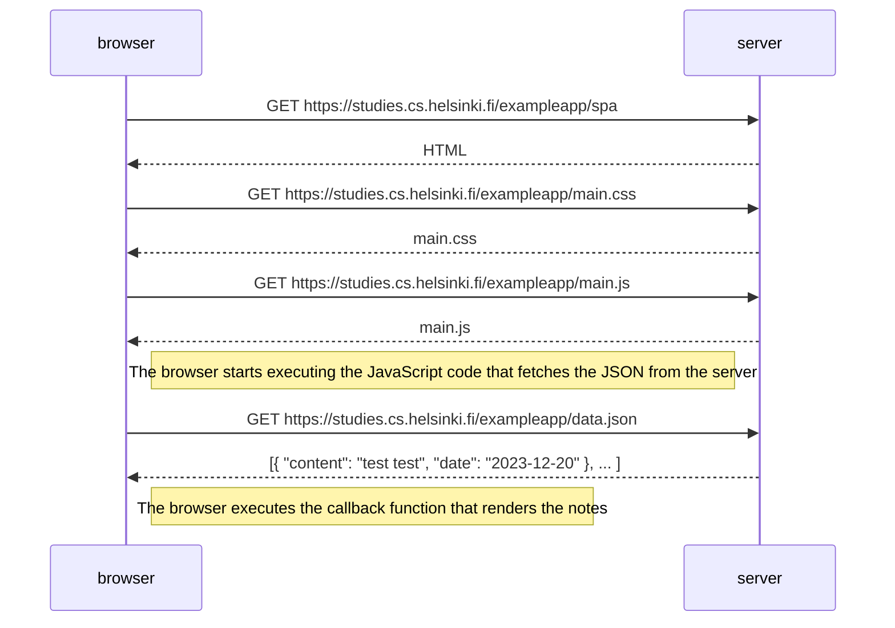

# 0.5: SPA

```mermaid
sequenceDiagram
    participant browser
    participant server

    browser->>server: GET https://studies.cs.helsinki.fi/exampleapp/spa

    server-->>browser: HTML


    browser->>server: GET https://studies.cs.helsinki.fi/exampleapp/main.css
    server-->>browser: main.css

    browser->>server: GET https://studies.cs.helsinki.fi/exampleapp/main.js
    server-->>browser: main.js

    Note right of browser: The browser starts executing the JavaScript code that fetches the JSON from the server
    browser->>server: GET https://studies.cs.helsinki.fi/exampleapp/data.json
    server-->>browser: [{ "content": "test test", "date": "2023-12-20" }, ... ]

    Note right of browser: The browser executes the callback function that renders the notes
```

